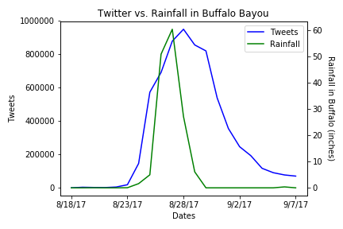

# Houston Emergency Coders
## Doug F Newsom

## Hypothesis

If we learn from our past lessons with Hurricane Harvey, then we will be able to significantly reduce future flood risk.

## Analytical Summary

### What impact did Harvey rainfall have on the reservoir elevation of Addicks Reservoir?

Reservoir data monitoring collected during 2017 from Addicks Reservoir shows rainfall from Harvey had a significant impact on the reservoir elevation. Although the reservor is often dry during the year (68 ft) elevation, the reservoir height rose to a record elevation (109 ft) during the hurricane. The major hurricane rainfall in the reservoir occurred from August 26 to August 28 which directly resulted in nine days of house flooding through September 6 from high reservoir levels (104 ft).

### What impact did Harvey rainfall have on the reservoir elevation of Barker Reservoir?

Reservoir data monitoring collected during 2017 for the Barker Reservoir shows similar trends to the Addicks Reservoir, indicating rainfall from Harvey also had a significant impact on the reservoir elevation. The reservoir height rose to a record elevation (104 ft) during the hurricane. The major hurricane rainfall in the reservoir also occurred from August 26 to August 28 which directly resulted in nine days of house flooding through September 6 from high reservoir levels (97 ft).

### How did Harvey affect areas of Bufalo Bayou flood inundation eastward from reservoirs to downtown?

Buffalo Bayou water monitoring data for 2017 from five gauges across the bayou were studied. This included the following streets in an eastwardly direction from the reservoirs toward downtown: Dairy Ashford, Beltway 8, San Felipe, Shepherd, and Milam. Water elevation trends remained consistant for each of the five locations during 2017 and throughout Harvey. However, bayou flood inudation levels were significantly less approximately halfway down the bayou.

       

### What impact did Harvey have on social media?

Through our research, it was a constant find to read that social media played an integral part during Hurricane Harvey. The amount of assistance and effort put out by millions of Twitter users alone contributed to the aid of flood victims. Here in the graph below shows the impact on Twitter and hit a peak of about 1M tweets sent on August 28, 2017. This brings a total of 7M tweets in a span of a month.

### What was the response from the City of Houston in relation to the events of Harvey?

The plot below shows the peak of activity on social media on August 28, 2017 and following close behind is the steady incline of service requests that were being sent to the City of Houston. The graph also shows an immediate drop in requests in the middle of the storm. As the days passed after the peak time on August 28th, residents of Houston were then able to sumbit their requests allowing them time to wait for the storm to steady.

### Was there a correlation between the time of flooding and social media posts?

The graph below shows the total amount of rainfall captured of all five gauges in the Buffalo Bayou from August 18, 2017 and September 22, 2017. This data shows a direct connection with social media and a pattern of users posting almost immediately following what seemed to be the most eventful day of the week storm. The peak for rainfall is displayed on August 27, soonafter seeing the affects of the flooding came the overwhelming tweets that reached it's peak of roughly 1M tweets.

### What is the estimate growth of the city of Houston in the next decades?

The City of Houston has exploded in last few decades and there is no sign that it will slow down, in fact estimations project that there will be a significant growth in the West side of the city. This population growth will be more affected by future storms and flood if no steps are taken today to protect upcoming neighborhoods from flood waters.

### What does the water levels in nearby creeks tell us about the future of the West side of Houston?

The water levels are getting higher, during Harvey we saw 500 year storm levels. It is important to tackle and prevent the nearby creeks from overflowing into the growing area of the counties of Fort Bend, Waller and Brazoria. On this chart, we can clearly see the how the water levels compared with previous storms and it paints an eerie picture of our future if we do not come up with solutions to protect incoming residents.

